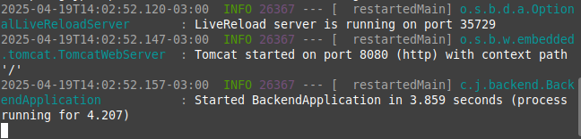
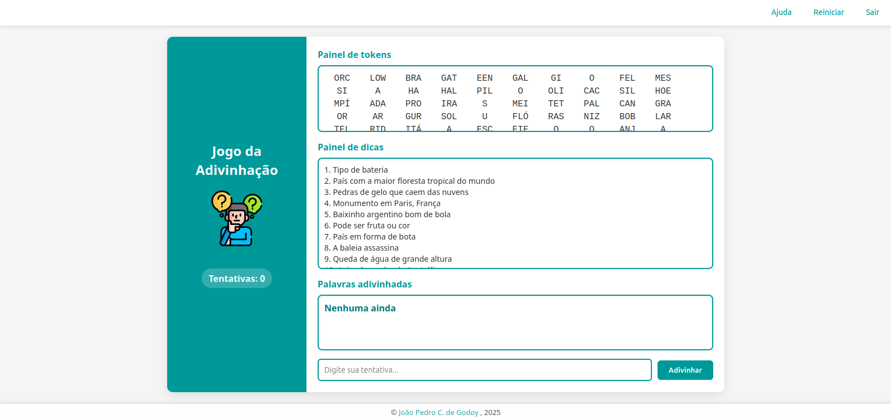

#  Jogo das Palavras – Projeto Full Stack Java

Este projeto é uma simples aplicação web interativa baseada no jogo de adivinhação com dicas e tokens de palavras embaralhadas.

##  Tecnologias Utilizadas

- **Backend:** Spring Boot (Java)
- **Banco de dados:** PostgreSQL
- **Frontend:** HTML, CSS e JavaScript puro
- **Servidor local de testes:** Python HTTP Server

##  Lógica da Aplicação

- O backend expõe um endpoint `/palavras` com uma lista de palavras e suas respectivas dicas.
- O frontend consome essa API usando `fetch()` e exibe os dados para o jogador.
- O jogador escolhe quantas palavras quer adivinhar (de 1 a 100).
- O jogo embaralha os tokens das palavras, mostra dicas e aceita tentativas.
- A cada acerto ou erro, há um feedback visual, e ao final da rodada, o sistema exibe uma tela de comemoração. 

##  Quantidade de Palavras

O banco atual contém **100 palavras** com suas respectivas dicas, cuidadosamente selecionadas para tornar a experiência divertida e educativa.

## 🛠 Configuração do Banco

Antes de rodar o backend, edite o arquivo src/main/resources/application.properties e substitua os dados de acesso ao PostgreSQL:

spring.datasource.username=seu-user

spring.datasource.password=sua-senha

Certifique-se de que o banco esteja rodando e o nome do banco de dados corresponda ao usado no seu projeto.

##  Imagens do Processo

### Tentando carregar as palavras sem rodar a API:

**Rodando o server**

**Erro de Carregamento**

### Rodando a API:
**Comando para rodar a API**

**API rodando**

### Tentando novamente carregar as palavras (agora funcionando!):
**Palavras carregadas**

**Jogo pronto**

##  Funcionalidades do Frontend

O frontend foi desenvolvido com foco na experiência do usuário e inclui diversas interações que tornam o jogo mais envolvente:

   - **Animações de feedback**:

       - Ao acertar uma palavra, o botão “Adivinhar” ganha uma animação de bounce com fundo verde.

       - Em caso de erro, o botão treme com uma animação de shake e fundo vermelho.

   - **Botões de menu acessíveis**:

       - ❓ Ajuda: Abre uma janela explicativa com instruções do jogo.

       - 🔁 Reiniciar: Permite começar uma nova partida com ou sem mudar o número de palavras.

       - ❌ Sair: Finaliza o jogo com uma tela de agradecimento.

   - **Modal de confirmação**:

        Em ações importantes como reinício ou saída, o sistema exibe uma janela modal de confirmação, promovendo uma navegação segura.

   - **Modo responsivo**:

        O layout foi ajustado para funcionar bem em dispositivos móveis, tablets e desktops.

##  Teste Agora!

A versão apenas frontend (com as palavras embutidas no código) já está publicada para acesso livre! Basta clicar no link abaixo para jogar diretamente do seu navegador:

https://projeto-jogo-das-palavras.vercel.app/

##  Execução Local

1. Clone o repositório
2. Configure o banco de dados PostgreSQL e rode o script com as palavras
3. Inicie o backend com `mvn spring-boot:run`
4. Suba o frontend com `python3 -m http.server`

##  Autor

João Pedro C. de Godoy - Estudante de Ciência da Computação – Unicamp  
[LinkedIn](https://www.linkedin.com/in/joão-pedro-coelho-18b623338) 
